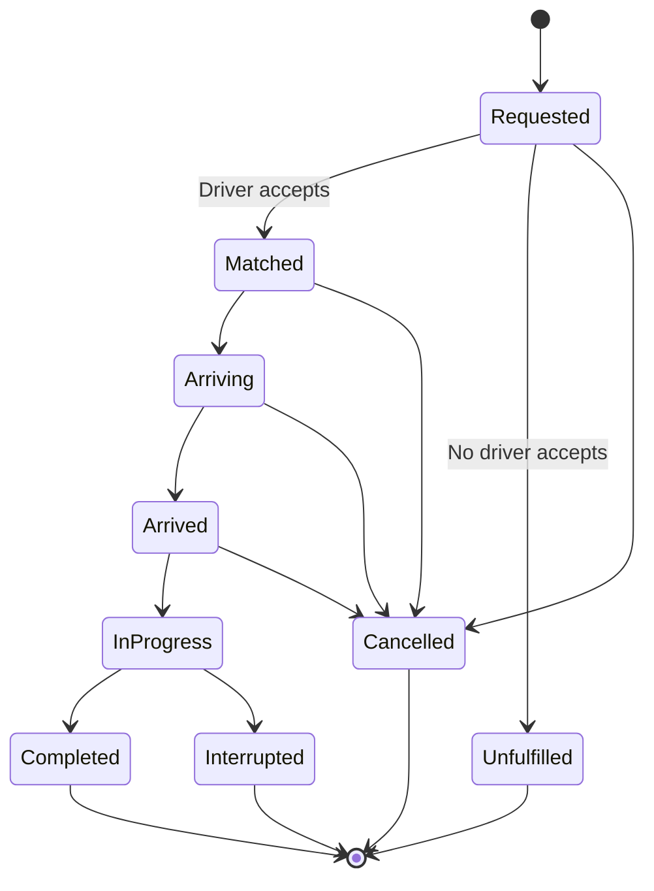

**Repository review — 6 September 2026**

This repository provides the screens and integrations for a rider booking prototype. It needs server-enforced identity, reliable payments, a real ride lifecycle, and an operating workflow for drivers before it can support a live ride service. The current architecture is a reasonable starting point; the most valuable work is completing these flows and making their outcomes trustworthy.

Scope: reviewed the tracked application, components, API handlers, state, types, configuration, and documentation at commit `23ee9fe`. Evaluated readiness for an Android/iOS rider app and the advertised web target. Recommendations for a commercial service include the driver and operator capabilities needed to fulfill rides. Visual recommendations are based on component code; no interactive device walkthrough was performed. Live database contents, provider dashboards, and deployed infrastructure were not inspected.

**Existing foundation**

- Expo SDK 54, React Native 0.81, React 19, strict TypeScript, and file-based navigation.
- Clerk email/password authentication and a guard around rider screens.
- Pickup/destination search, map rendering, driver selection, and a payment-sheet integration.
- Database handlers for users, drivers, ride creation, and ride history, using parameterized SQL.
- Shared buttons, inputs, ride cards, bottom sheets, typography, and color configuration.
- Secure token storage and a committed dependency lockfile. The root `.env` is ignored by Git.

These are implemented building blocks, not evidence that every integration works in a deployed app.

**Release blockers, in priority order**

| Priority | Finding and evidence | Required improvement |
| --- | --- | --- |
| P0 | API handlers do not authenticate callers. `app/api/ride/[id]+api.ts:3` queries whichever user ID appears in the URL; `app/api/ride/create+api.ts:7` accepts a caller-supplied user ID. Screen protection in `app/(root)/_layout.tsx` does not secure these endpoints. | Verify Clerk sessions on the server, send session tokens from native clients, derive the user from the verified session, and enforce resource ownership. Apply role checks to future driver/operator actions. Add bounded request sizes, schema validation, and rate limits. |
| P0 | Callers control fare and payment state. Ride creation accepts `fare_price` and `payment_status`; Stripe creation trusts `amount` and looks up a customer using submitted email; Stripe confirmation accepts submitted customer/intent IDs. | Create an expiring quote on the server. Store integer minor units and currency. Bind the quote, booking, Stripe customer, and PaymentIntent to the authenticated rider. Only trusted server transitions may set payment state. |
| P0 | Payment and booking can disagree. `app/api/stripe/pay+api.ts:27` reports success without checking the returned intent status. `components/Payment.tsx:147` saves a paid ride before PaymentSheet finishes and continues after a database-save error. Several callback error paths only show an alert and return. | Persist a pending booking, use a supported PaymentSheet confirmation flow, return callback errors consistently, and reconcile payment state using verified Stripe webhooks. Add idempotency and recovery for retries, application termination, and database failure. |
| P0 | Money loses its decimal part: `parseInt(amount) * 100` appears in `app/api/stripe/create+api.ts:44` and `components/Payment.tsx:51,161`. A displayed USD 18.75 becomes 1,800 cents. | Calculate and store the authoritative amount as integer minor units; format it for display only. Validate the amount against the booking quote when processing payments. |
| P1 | Driver discovery is simulated. `lib/map.ts:15` places drivers randomly around the rider. Lines 90–97 and 127–130 generate random prices and times as fallbacks. `app/api/driver+api.ts:6` returns all drivers without availability or location filtering. | Implement driver availability, timestamped locations, nearby matching, and genuine ETAs. Represent unavailable routes or drivers explicitly. Any simulation should be confined to an explicit demo environment. |
| P1 | The ride flow ends at a success modal. The six API handlers contain no matching, acceptance, arrival, start, completion, or cancellation transitions. | Introduce a server-owned ride state machine, driver acceptance, live progress, cancellation rules, and active-trip recovery. Provide a driver interface and an operator workflow capable of fulfilling a booking. |
| P1 | Web export fails on a native-only Stripe import from `components/Payment.tsx`, reached through `app/(root)/book-ride.tsx`. Maps and token storage also need a web compatibility review. | Decide whether web is a full rider client. Split native and web payment/map/storage implementations, or provide a deliberately limited web surface that still permits server export. Re-run export after each blocker is fixed. |
| P1 | Deployment is not reproducible from the repository. There are no committed database migrations, seed setup, build profiles, CI workflows, or `.env.example`. `lib/fetch.ts:13` defaults to localhost, while `app.json` contains a separate `https://uber.dev/` router origin. | Document and configure the actual HTTPS backend, validate environment variables, commit migrations and synthetic seed data, and define development/staging/production builds. Configure native Maps credentials and test installed builds. |

Stripe recommends receiving asynchronous payment events to trigger server work; its PaymentSheet integration also requires calling the completion callback with a client secret or an error. Apply the pattern compatible with the installed SDK and explicitly test authentication-required cards. [Stripe mobile payment guide](https://docs.stripe.com/payments/mobile/accept-payment?platform=react-native&type=payment).

Expo API routes execute on a deployed server in production. A mobile bundle alone does not deploy this backend. The custom URL resolver currently chooses its own absolute URL, so the router origin does not fix its localhost fallback. [Expo API routes](https://docs.expo.dev/router/web/api-routes/).

**Concrete bugs and incomplete behavior**

| Area | Observed behavior | Improvement |
| --- | --- | --- |
| Email verification | A failed code sets state to `failed`, but the verification modal is visible only for `pending` (`app/(auth)/sign-up.tsx:62,159`). Its error message and retry field disappear. | Keep the verification step open on errors; add resend with a cooldown, edit-email recovery, and submission guards. |
| Account creation | The user's name is written to the local database but is not passed to Clerk signup; home/profile read Clerk name fields. Database insertion precedes finalizing the session. | Define the source of truth for profile fields. Synchronize users using verified, retryable upserts or verified Clerk events, so a transient failure cannot strand registration. |
| Authentication | No password-recovery screen; incomplete sign-in states become a generic failure. Submission labels change, but the buttons are not disabled while fetching. The Google OAuth helper has no screen caller. | Finish recovery and required verification states, prevent repeated submits, and deliberately implement or remove dormant social-login code. |
| Location | Denied permission leaves the home map loading; GPS/reverse-geocoding failures have no catch; `address[0]` assumes a result (`home.tsx:48`). | Explain the denied state, offer manual pickup and settings access, and handle GPS timeout and empty address results. |
| Coordinates | Truthiness checks reject legitimate latitude/longitude zero in map utilities and ride validation. Places details can also be absent despite non-null assertions. | Validate finite numbers and geographic ranges; distinguish missing values from zero. |
| Ride search | “Find Now” advances without validated pickup/destination; an empty driver list always displays a spinner (`confirm-ride.tsx:23`). | Guard each booking step and distinguish loading, no drivers, route unavailable, and recoverable request errors. |
| ETA | `calculateDriverTimes` combines driver-to-pickup and pickup-to-destination time, but booking labels it “Pickup Time.” | Model pickup ETA and trip duration separately, with a stable quote and explicit units. |
| Maps and requests | `initialRegion` does not follow subsequent destination changes. The common trip route is requested once per driver, and overlapping requests can overwrite newer state. Every ride screen mounts another Map. | Update the camera intentionally, calculate shared route data once, cancel obsolete requests, cache suitable results, and decouple booking calculations from map rendering. |
| Ride history | Errors appear in logs while the screen can say there are no rides. No pagination, pull-to-refresh, or booking-triggered invalidation. “Date & Time” displays a date plus trip duration. | Show retryable errors, refresh after mutations, paginate using stable ride IDs, and show actual timestamps separately from duration. |
| State recovery | Zustand stores are memory-only and have no full reset. Sign-out does not clear destinations/drivers. There is no persisted active-booking reference. | Clear user-scoped state on sign-out, persist only appropriate preferences/IDs, and restore the authoritative active trip from the server. |
| Profile and chat | Profile fields all use `editable={false}`. Chat is a static “No Messages Yet” screen with friends/family copy. | Add profile editing and account settings. Implement conversations scoped to the assigned ride and a real support channel. |
| Display details | Driver cards hardcode rating `4`; several screens use undefined `font-JakartaRegular`; Geoapify is documented as optional but ride cards always request its image. | Render actual ratings, normalize typography tokens, and add a map-thumbnail fallback. |

**What a complete initial service needs**

For riders: registration/recovery, editable account and contact details, valid pickup/destination, an upfront quote, booking, matching, driver/vehicle identity, live pickup progress, active-trip status, cancellation, a receipt, ride history/detail, and help for payment or trip issues. Include saved places, notification preferences, and account deletion as account features.

For drivers: an authenticated driver role, operator-approved driver/vehicle records, online/offline availability, location reporting, timed offers, accept/reject actions, navigation handoff, arrival/start/complete/cancel actions, and a view of completed work. Prevent two riders from reserving the same driver and two drivers from accepting the same ride through database-enforced concurrency controls.

For operators: approve or suspend drivers, inspect active rides, handle unmatched or interrupted rides, review payment discrepancies, issue authorized refunds, and resolve support requests. Record who changed important ride/payment states. Agree the driver compensation and payout model before treating the service as commercially complete.

Represent ride progress explicitly:

Keep payment state separate: pending, authentication required, authorized, paid, failed, and refunded have different meanings from ride progress. Define the authorization/capture timing and cancellation policy as product decisions, then enforce them on the server.

**Modern product and interface improvements**

- Make the home screen centered on booking: visible pickup, a prominent destination field, saved Home/Work places, recent destinations, and a persistent active-trip card when a booking exists.
- Make ride selection easy to compare: service category, passenger capacity, pickup ETA, estimated trip duration, total price, and availability. For an automatically dispatched service, select the service category and show the assigned driver after acceptance.
- Keep route and quote visible through confirmation, with a clear final amount and one primary action. Show matching and driver arrival immediately after booking.
- Use a shared theme for surfaces, typography, spacing, focus/pressed/disabled/loading states, and status colors. `userInterfaceStyle: automatic` currently coexists with hardcoded white surfaces and a forced light map; implement actual light and dark themes together.
- Improve accessibility: descriptive labels and roles, selected/disabled states, scalable text, sufficient contrast, comfortable touch targets, and reduced-motion behavior. Validate bottom sheets with VoiceOver/TalkBack and larger text.
- Consolidate keyboard and safe-area handling. Replace layout decisions based on the title string in `RideLayout` with explicit props, and use bottom-sheet-aware list primitives for driver selection.
- Replace raw network errors and console-only failures with useful inline messages and retry actions. Distinguish loading, empty, offline, unavailable, and failed states throughout the app.
- Use consistent product copy and branding; replace “Choose a Rider,” “Example, Inc.,” and generic chat text. Localize currency, dates, distances, and language for the chosen operating market.
- Add subtle feedback for location selection, driver matching, and payment completion. Scheduled rides, multiple stops, promotions, tips, and premium categories can follow once immediate rides are reliable.

These are design recommendations from the implementation; their final layout should be checked on small screens, tablets if supported, and real devices.

**Technical direction**

Retain Expo/React Native, Clerk, Neon/Postgres, Stripe, and Zustand initially. Add service boundaries for authentication, quotes, bookings, payments, dispatch, and notifications. Route handlers should validate input and call these services, rather than duplicate business rules or accept client-provided authoritative state.

Add versioned migrations for users, drivers, vehicles, driver locations/availability, quotes, rides, ride events, payments, webhook receipts, device tokens, and support records as the respective features are implemented. Define foreign keys, unique provider IDs, valid states, time/amount units, indexes for rider history and nearby drivers, and deletion/retention behavior. The actual live database schema must be inspected before choosing migration steps.

Extend or replace `lib/fetch.ts` with a typed, authenticated data layer that supports conditional queries, cancellation, timeouts, controlled retries, and cache invalidation. Use Zustand for local selections and preferences; persist authoritative trips in the backend. Do not blindly retry booking or payment writes without idempotency.

Use authenticated real-time subscriptions for foreground ride changes and a device notification path for relevant background events. Re-fetch authoritative trip state on reconnect and resume. Introduce jobs for expired driver offers and payment reconciliation; a single client session cannot reliably own this work.

Move Google web-service routing/quote requests behind authenticated, bounded server endpoints and restrict native map keys by platform/application. Public Clerk and Stripe publishable keys are expected in clients; server secrets must stay server-side. Google recommends an authenticated proxy where appropriate for mobile access to its web-service APIs. [Google Maps security guidance](https://developers.google.com/maps/api-security-best-practices).

Use development builds and installed preview builds to validate native configuration. The current scripts force Expo Go, and `app.json` lacks the Android Maps key configuration documented for this SDK. Expo Go map rendering does not establish that a store binary is configured correctly. [Expo SDK 54 Maps setup](https://docs.expo.dev/versions/v54.0.0/sdk/map-view/), [Expo development builds](https://docs.expo.dev/develop/development-builds/introduction/).

Add structured errors, crash reporting, request/booking correlation IDs, and alerts for payment/booking divergence. Remove or redact logs of precise coordinates and raw ride history. Measure booking conversion, matching failures, cancellation, and API/provider failures without unnecessarily recording sensitive trip data.

**Suggested implementation sequence**

| Phase | Deliverable | Completion criterion |
| --- | --- | --- |
| 1 — Trustworthy foundation | Authenticated APIs, ownership checks, input/environment validation, migrations, accurate money, reproducible setup, and lint fixes. | Unauthenticated requests are rejected; one rider cannot access another rider's records; client-supplied payment status is rejected; USD 18.75 remains 1,875 cents throughout. |
| 2 — Reliable booking and payment | Server quote, pending booking, bound PaymentIntent, webhook verification, idempotency, authentication-required payment handling, and recovery. | Duplicate taps and webhook delivery produce one booking/payment effect; declined/authentication-required cards are handled; killing the app after payment still permits recovery of the correct booking state. |
| 3 — Fulfilled rides | Driver workflow, availability, matching, ride transitions, foreground updates, notifications, cancellation, and operator support. | A rider and driver complete a real staged trip; concurrent offers cannot double-assign; no-driver, cancellation, stale-location, and reconnect scenarios have explicit outcomes. |
| 4 — Complete rider experience | Profile/recovery, saved places, trip details/receipts, support, consistent themes, accessible components, and platform-specific web behavior. | Core flows work with denied location permission, slow connectivity, large text, screen readers, and app resume; every advertised navigation destination has useful behavior. |
| 5 — Release readiness | CI, supported-platform exports/builds, monitoring, backup/restore procedure, staging/production setup, deployment and rollback documentation. | A clean checkout can provision a test database and run checks; installed iOS/Android builds pass the journey suite; web builds if retained; a staged backend failure is observable and recoverable. |

Start with phases 1 and 2. Visual work can then build on stable booking states. Avoid broad dependency churn until the current baseline is reproducible; evaluate SDK/library upgrades with their compatibility guidance and installed-device tests.

Meaningful automated coverage should focus on identity/ownership, invalid coordinates, money conversion, quote expiry/tampering, payment status transitions, webhook signature/replay handling, duplicate bookings, competing driver acceptance, signup retry, and denied-location recovery. Add a small end-to-end suite covering signup/sign-in, quote, booking, payment, trip completion/cancellation, history refresh, and recovery after relaunch.

**Verification performed**

| Check | Result |
| --- | --- |
| `node node_modules/typescript/bin/tsc --noEmit` | Passed. |
| ESLint across app, components, lib, store, types, and constants | Failed with 3 formatting/import-order errors: `confirm-ride.tsx:2`, `types/image.d.ts:24`, and `types/type.d.ts:139`. No warnings. |
| Jest test discovery with `--listTests --runInBand` | No tests discovered. |
| `expo install --check` with offline mode | Reported dependencies up to date for the installed SDK; the command warns that offline validation is limited. This is not a current vulnerability audit or proof of latest-version compatibility. |
| Web production export, with root `.env` loading disabled | Failed when the shared payment import reached Stripe's native-only `codegenNativeComponent`. This is the first observed export blocker; later failures may exist. |
| Android JavaScript/assets export, with root `.env` loading disabled | Passed: 1,892 modules bundled, with a 6.04 MB Hermes bundle and 67 asset entries. This was not an APK/AAB build or a device runtime test. |
| Isolated ride-history handler probe with mocked database | A request without an auth header returned 200 and queried the caller-selected other user ID. |
| Isolated ride-create handler probe with mocked database | An unauthenticated request with another user ID, fare `1`, and status `paid` returned 201 and forwarded those values to the insert. |
| Isolated Stripe-create handler probe with mocked Stripe | Amount `18.75` was passed to Stripe as `1800` minor units. |
| Isolated Stripe-confirm handler probe with mocked Stripe | A returned intent status of `requires_action` still produced HTTP 200 and `success: true`. |

Handler probes used in-memory mocks and made no external calls or real database/payment mutations. Export checks disabled root `.env` loading and wrote generated output under the temporary directory. An export verifies bundling, not native compilation, installation, provider configuration, or a completed real-world journey. No deployed endpoint penetration test, dependency vulnerability scan, or native-device payment test was performed.

This review adds documentation only; application behavior has not been changed.
